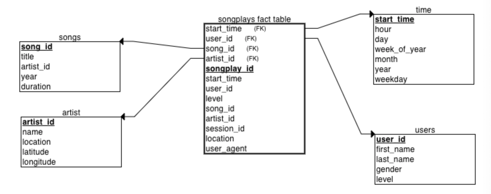

# Project: Data Modelling with Postgres
## Introduction
A startup called Sparkify wants to analyze the data they've been collecting on songs and user activity on their new music streaming app. The analytics team is particularly interested in understanding users behaviour like what songs users are listening to or on what time of the day users would like to use the app. Currently, they don't have an easy way to query their data, which resides in a directory of JSON logs on user activity on the app, as well as a directory with JSON metadata on the songs in their app.

This project's goal is to create a Postgres database with tables designed to optimize queries on song play analysis. In this project, based on the requirement, the database was designed based on star schema with fact table `songplays` and dimension tables like `songs`,`users`,`artists`, and `time`. All the data was extracted from aforementioned JSON log and song files. An ETL pipeline was built to process those data. Finally, the databased was tested with some possible song analysis SQL queries.

## Project Description
This project focused on data modelling with Postgres and building ETL pipelines using Python.

The major steps include:

### Create tables

* Write `CREATE` and `DROP` statements in the `sql_queries.py` file to create and drop tables.
* Write `create_tables.py` to make connections to Postgres and create database and tables.

### Database schema design

Since our focus is to build a database for the analytics team to understand users behaviour like what songs users are listening to. There could be a lot of aggregations over songs or time data, while ad-hoc analysis probably won't be a major concern here. So star schema could be a good solution for this case. As if there is a particular analytic focus, fact and dimension tables for a star schema would make the queries faster and easier.

So in our case, the `songplays` table is the fact table and there are four dimension tables, which are `time`,`user`,`songs` and `artists`.

### ETL

Since all the data are stored in JSON file, so this ETL pipeline extracted all the data from JSON, and transformed some of the columns and loaded the transformed information into corresponding database tables. The methodology used here was first experiment single JSON file to extract and transform the data in the `etl.ipynb` Jupyter Notebook, after this tiny experiment succeeded, then a python script `etl.py` was written based on the experiment, this script could be run to load all the required information into the database tables.

## How to run the scripts

* First run `create_tables.py` to create database and tables.
* Then run `etl.py` to load data into tables.
* Finally run `test.ipynb` to test out the created databse.

## Sample SQL queries

What are the top 10 songs users are listening to?

    `SELECT s.title, count(sp.song_id) as counts
     FROM songplays sp
     JOIN songs s ON sp.song_id=s.song_id
     GROUP BY sp.song_id
     ORDER BY counts DESC
     LIMIT 10`

What are the usual hours when users listen to music?

    `SELECT hour, count(hour) as counts
     FROM time  
     ORDER BY counts DESC
     LIMIT 5`
